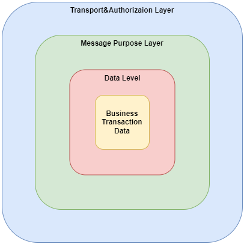

# Interaction Protocol
Here you can find information about our interaction protocol.
Our API interaction protocol is implemented as a nested container with three levels:
- [Transport&Authorization Level](transport_level.md) This level contains authorization data and is configured depending on the selected data transfer protocol.
- [Message Purpose Level](purpose_level.md) This level contains information about the purpose of the message (our system supports several [message types](message_types.md))
- [Data Level](data_level.md) This level contains information about the business content of the message.




### Общее сообщение (GeneralMessage)
```
{
/// Тип сообщения
    "Type":"string", 
/// уникальный идентификатор сообщения
    "CorrelationId":"string",
/// Время сообщения в формате ISO 8601 "2012-03-21T05:40Z" "TimeStamp":"date",
/// Необязательный параметр может присутствовать только в сообщениях типа Request
/// время жизни сообщения если оно попадает в очередь.
/// формат [d.]h:mm:ss[.fffffff]
/// d - Необязательное число дней
/// h - Количество часов в диапазоне от "0" до "23"
/// mm - Количество минут в диапазоне от "00" до "59"
/// ss -  Количество секунд в диапазоне от "00" до "59"
/// fffffff - Необязательная доля секунды
    "TTL":"Timespan",
/// Необязательный параметр может присутствовать только в сообщениях типа Response
/// Время выполнения запроса "ExecutionDuration":"Timespan",
/// Структура зависит от типа сообщения
    "Payload":"object"
}
```
### Типизированные сообщения
Доступные типы сообщений

| Тип сообщения          | Описание                                                                                      |
|------------------------|-----------------------------------------------------------------------------------------------|
| Request                | запрос на выполнение какого либо сервиса системы                                              |
| Response               | ответ системы                                                                                 |
| Event                  | события системы передаваемые клиенту (не реализовано) скорее всего будет реализация в виде кб |
| Auth                   | запрос авторизации                                                                            |
| AuthResult             | ответ на авторизацию                                                                          |
| ReAuth                 | авторизация по токену, получаемого при авторизации                                            |
| ReAuthResult           | ответ на операцию авторизации по токену                                                       |
| Logout                 | выход из авторизированной сессии, и удаления токена                                           |
| SessionProlongate      | запрос на продление сессии (не реализовано)                                                   |
| SessionValidate        | проверка сессии (не реализовано)                                                              |
| RequireConfirm         | требуется подтверждение                                                                       |
| ConfirmOperation       | подверждающая операция                                                                        |
| CancelConfirmOperation | операция, отменяющая подтверждение                                                            |
| RenewConfirmationCode  | операция, обновляющая подтверждение                                                           |
| Error                  | ответ сервера в случае ошибки на любой запрос пользователя                                    |

#### Структуры типов сообщений
##### Request
```
{
/// тип
    "Type":"string",
/// зависит от типа
    "Payload":"object",
/// необязательное приоритет обработки
/// может принимать значения
/// Low
/// Normal
/// High
    "Priority":"string"
}
```
##### Response
```
{
/// результат обработки запроса
    "ResultCode":"string",
/// Объект результата
    "Result":"object",
/// если результата выполнения ошибка
    "Error":"Error"
}
```
##### Event
```
{
/// тип
    "Type":"string",
/// зависит от типа
    "Payload":"object"
}
```
##### Error
```
{
/// код ошибки
    "Code":"string",
/// описание ошибки
    "Message":"string"
}
```
## Специальные сообщения
### Авторизация
#### Запрос:
```
{
    "Login":"string",
    "Password":"b64string",
    "DeviceId":"string",
    "Encrypted":"bool",
    "PublicKey":"b64string"
}
```
#### Ответ:
```
{
/// ключ шифрования
    "EncryptedKey":"b64string",
    "HOTPKey":"b64string",
    "TokenId":"string",
    "SessionId":"string",
    "SessionExpire":"Timespan",
    "SessionExpireDate":"date",
    "ServerTime":"date"
}
```
### Реавторизация
#### Запрос:
```
{
    "Login":"string",
    "TokenId":"string",
    "HOTP":"string",
    "Encrypted":"bool",
    "PublicKey":"b64string"
}
```
#### Ответ:
```
{
/// ключ шифрования
    "EncryptedKey":"b64string",
/// вектор инициализации
    "InitializationVector":"b64string",
    "SessionId":"string",
    "SessionExpire":"Timespan",
    "SessionExpireDate":"date",
    "ServerTime":"date",
}
```
### Алгоритм шифрования
AES 256 GCM  
Шифрование доступно только при использовании RSA ключей.

### Алгоритм построения подписи
Для осуществления запросов в BroPay API необходимо обладать следующими данными:

- apiKey - идентификатор ключа пользователя для осуществления запросов в BroPay API;
- hmacKey - секрет ключа пользователя (для каждого apiKey свой).

Оба параметра создаются при заведении API пользователя.  
Далее при формировании подписи необходимо руководствоваться следующим алгоритмом:

1. Сформировать сообщение в формате JSON в виде строки UTF-8;
2. Превратить hmacKey из Base64-строки в байтовый массив;
3. Сформировать подпись с помощью HMAC-алгоритма на основе отправляемого сообщения (1) и секрета (2);
4. Подпись (3) превратить в Base64-строку;
5. Указать полученную подпись (4) в поле Signature отправляемого сообщения.