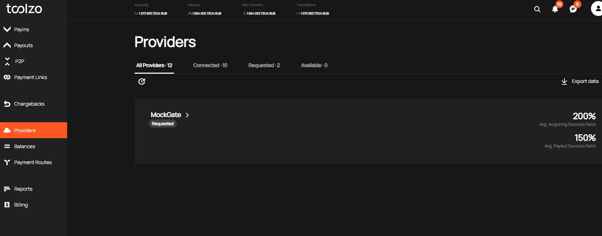

# New terminal connection
You need to go in your Personal cabinet section "Providers"

## First step
You need to select the provider that owns the terminal you want to connect

>:bulb: For test is available the Provider **Mockgate**    
>In the production mode, all providers with which we have technical integration are available

## Second step
 Then you need to add new terminal

 In the form that appears, you need to specify terminal parameters:
- Currency;
- Terminal Name;
- Credentials;
- Websites;
- Payment methods for Payin and Payout transactions;

### Currency
Here you need to select the currency, which approved your Provider to transactions via this terminal
>:bulb: If you have a multi-currency terminal, you need to add several terminals 

### Terminal name & Credentials
When you are connecting to a test provider, terminals use simple credentials:
- Terminal name: "Test terminal"
- Token: "12345"

When you are connecting to a production provider, use the terminal name as you wish and specific credentials for terminal which you become from the Provider

### Websites
Here you select websites(connections to our system) which can use this terminal.

### Payment Methods
Here you select payment methods for Payin/Payout available for this terminal. 
>:bulb: For the test terminal you can select methods which you want to test.

## Third step
After adding the terminal it is in the Status "Blocked". Support team verifies and changes it to the status "Active".
All your terminals by your provider you can see in the section "Connected terminals". Here you can stop your terminal or change credentials.

[Go back to Introduction](readme.md#environments)