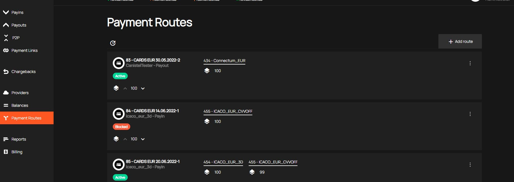
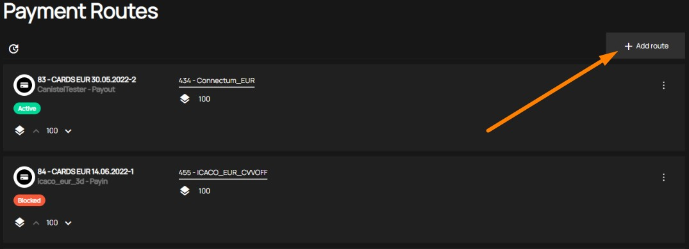
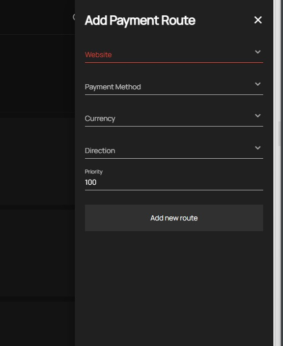
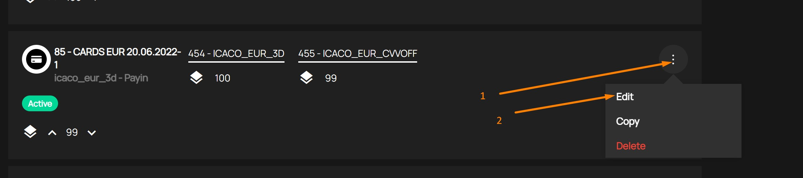
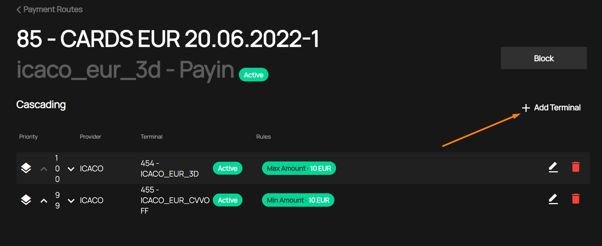
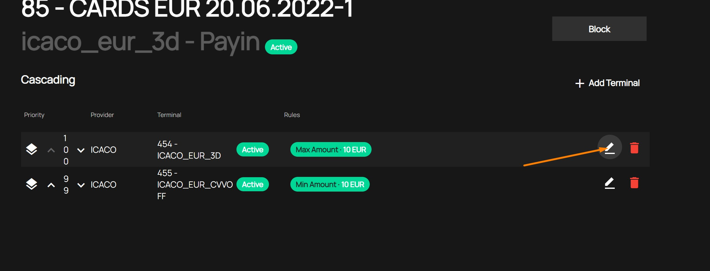

# New route
>:bulb: For all payment methods that you will use in our System, you need to create one or more routes.

You need to go in your Personal cabinet section "Payment Routes"

## First step
You  need to add route

In the form that appears, you need to specify route parameters:
- Website;
- Payment method;
- Currency;
- Direction;
- Priority.

### Website
Here you need to select the website to which this route is available.
>:bulb: One website can use multiple routes.The choice will be made based on the priority of the route and the rules for the terminals included in this route.

### Payment method
Here you need to select the method for which the route is configured.
>:bulb: You can have multiple routes for one Payment Route. The choice will be made based on the priority of the route and the rules for the terminals included in this route.

### Currency
Here you need to select the currency for which the route is configured.
>:bulb: You can have multiple routes for one Currency. The choice will be made based on the priority of the route and the rules for the terminals included in this route.

### Direction
Here you need to select the payment direction for which the route is configured.
>:bulb: You can have multiple routes for one Direction. The choice will be made based on the priority of the route and the rules for the terminals included in this route.
### Priority
Here you need to select the priority of the route
>:bulb: The route with the higher priority is selected first for the transaction.
## Second step
You need to add terminal(s) in the Route.   
You can make when you edit a route

### Add Terminal
You can add one or more terminals in one Route

>:bulb: You can add in a route only active terminals

In addition to terminal data, you need to specify the priority of the terminal in the route 
>:bulb: The terminal with the higher priority is selected first for the transaction.

#### Add rules (optional)
Here you can and specific rules for the terminal in a route.

>:bulb: Adding rules for the terminal is optional. If you do not add rules to the terminal, then the choice of this terminal will depend only on its priority.

[Go back to Introduction](readme.md#environments)
