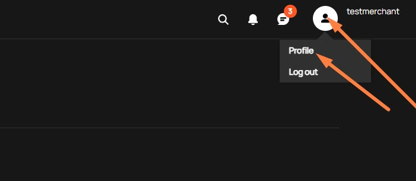
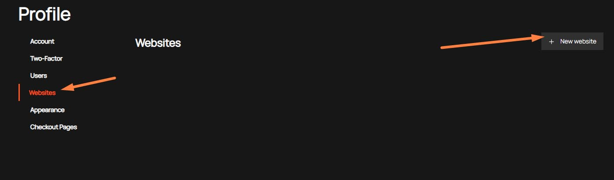
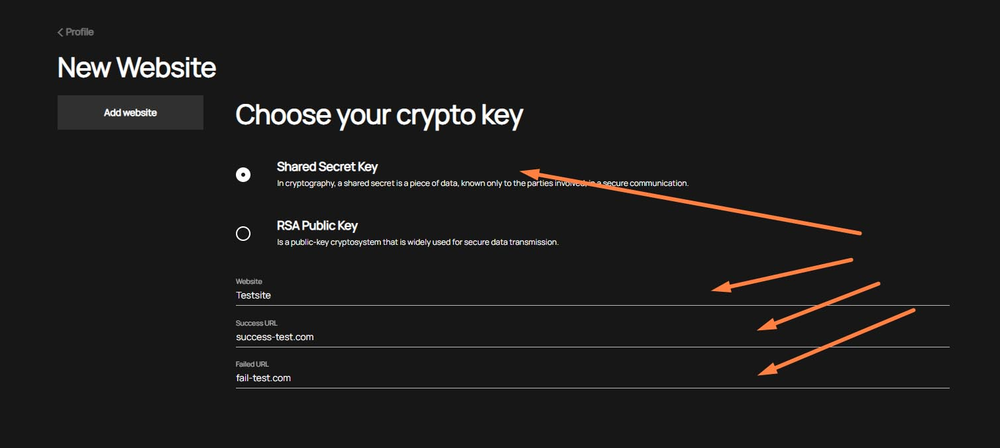
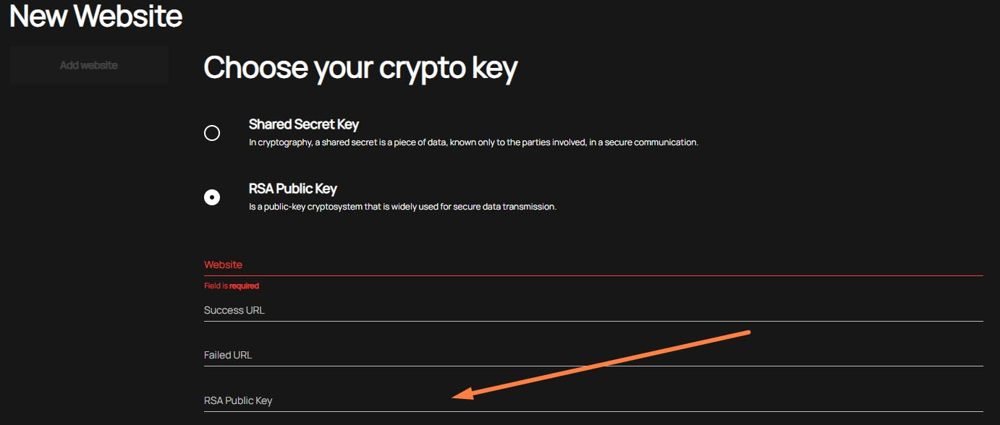
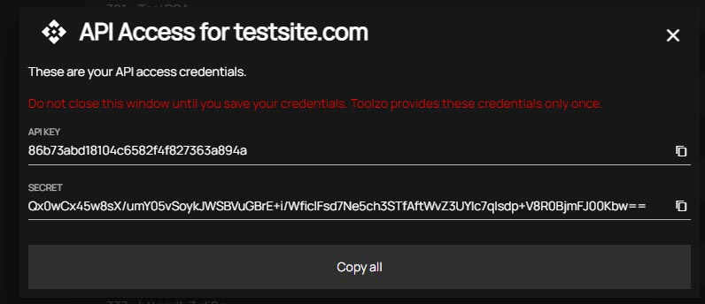

# New API connection
For use API methods you need to create a connection (in our system we name it "website").  
>:bulb: During the initial connection, the base website (for test and production mode) is created by our support team. If you want to have a several connections to our system you need to create additional websites

You can do it in your "Profile"         
- [Where is my Profile?](#First-step)
- [How to create my new connection?](#Second-step) 

## First step
You need to log in to your personal cabinet and go in your Profile.

## Second step
Next you need to change "Website" and then "New website" 

## Third step
In the opening form you need to:
1. choose [encryption key type](#Encryption)
2. input [website domain, success url and failed url](#Website) 

### Encryption
All messages we transfer must be encrypted. To encryption, we can use a shared key or each of us can use our own RSA key.    
>:bulb: The Shared Secret key we generate automatically when you add new website

#### Shared secret key
We recommend use this method. You need to select "Shared Secret Key" and input parameters:

#### RSA Public key
If you want to use own crypto certificate you can use this variant.
In addition to the basic parameters (Website, Success URL, Failed URL), you need to specify your RSA Public Key

>:bulb: In response, we will send our public key.
### Website 
Website - name of your website (account)    
>:mega: _We strongly recommend use your real domain names that you will register on the terminals of your provider_

### Success Url
Success Url - The url to which we'll return our callback about a successful operation
### Failed Url
Failed Url - The url to which we'll return our callback about an unsuccessful operation or a some error

## Fourth step
After fill required website creation parameters  and click the button "Add website", you will see a window with credentials for connection to our API

[Go back to Introduction](readme.md#environments)