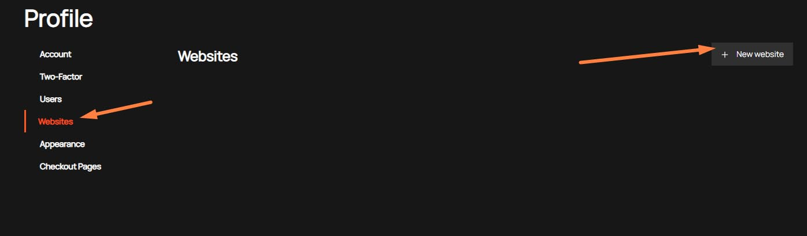
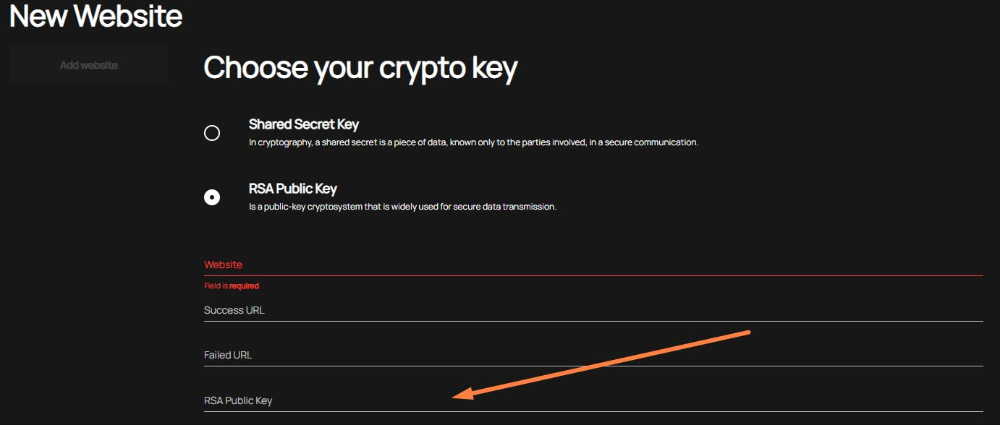

# New account (website) connection
For use API methods you need to create account (in our system we name it "website").    
You can do it in your "Profile"

## First step

## Second step

## Third step
:bulb: You can use the Shared Secret key we generate or provide your public key

### Shared secret key
We recommend using this method. You need to select "Shared Secret Key" and input parameters:
- Website - name of your website (account)  
:mega: _We strongly recommend use your real domain names that you will register on the terminals of your provider_
- Success Url - The url to which we'll return your customer in case successful operation
- Failed Url - The url to which we'll return your customer in case unsuccessful operation or some error 

### RSA Public key
If you want to use own crypto certificate you can use this variant.
In addition to the basic parameters (Website, Success URL, Failed URL), you need to specify your RSA Public Key

## Fourth step
After fill required website creation parameters  and click the button "Add website", you will see a window with credentials for connection to our API

