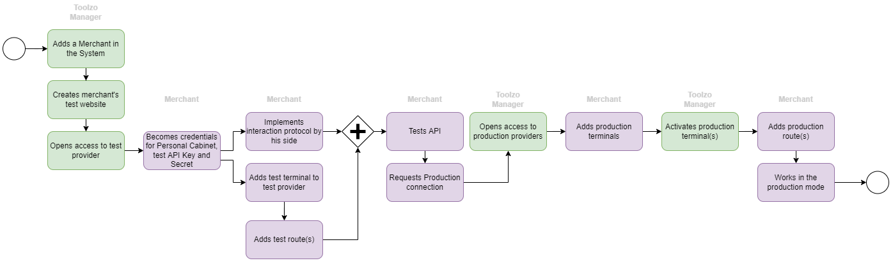
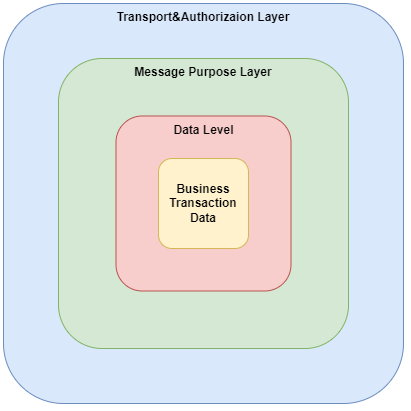

This document describes the usage of the Toolzo API.

# Environments
There are two environments which can be used by our clients - production and sandbox, also known as test environment.
For use these environments you need to contact our support team (e-mail: support@toolzo.com), and we will provide you with the necessary credentials to your personal cabinet.

The sandbox environment is used only for TESTING purposes. When you are processing a payment using your configuration for the test environment the payment WILL NOT bring a real financial impact. This environment is used only to simulate and test different payment scenarios.  
In the production environment you cannot use any simulated test data. When you are processing payments using your configuration for the production environment the payment WILL bring a real financial impact.  
# Connect to our API
The process of connecting to our api contains the following steps   

## First step "Become credentials for Personal cabinet"
You need to become credentials to your personal cabinet by our support team (e-mail: support@toolzo.com).

## Second step "Create website"
You need to create new website and generate API credentials in your [personal cabinet](pers_cab_website_creation.md#new-api-connection)

## Third step "Add terminals(s)"
You need to add terminals

## Fourth step "Add route(s)"
You need to add routes

# Fifth step "Realize interaction protocol"
Our interaction protocol is implemented as a nested container with three levels: 
- [Transport&Authorization Level](transport_level.md) This level contains authorization data and is configured depending on the selected data transfer protocol.
- [Message Purpose Level](purpose_level.md) This level contains information about the purpose of the message (our system supports several [message types](message_types.md))
- [Data Level](data_level.md) This level contains information about the business content of the message.

  
